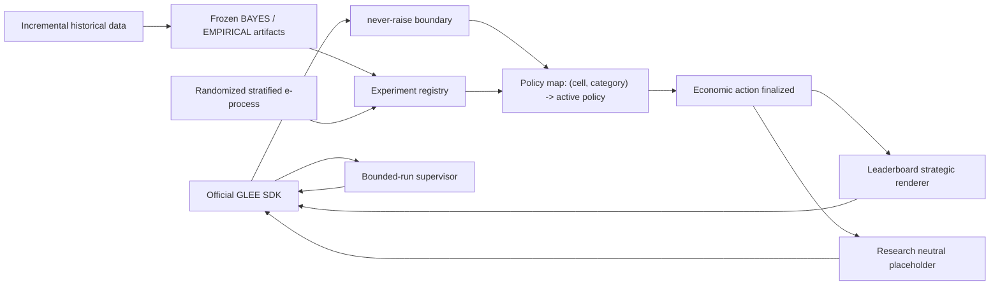

# Architecture

One transport process queues all selected game families through the official SDK. Each
arriving server-assigned game is classified by exact configuration and disclosed opponent
category (`human`, `agent`, or `hidden`). `leaderboard/policy_router.py` reads the policy
map and selects the currently supported policy for that tuple; there is no cross-cell
winner and the agent never chooses a cell.

## Configuration routing

Routing is an explicit derivation, not a dictionary lookup with a generic default. Every
decision logs `game_family`, exact `cell`, `role`, `theory_baseline`, BAYES eligibility,
loadable artifacts, promoted policy, selected policy, and fallback reason.

The family rules are:

- Bargaining selects one of the four configuration-specific theory incumbents
  (complete/incomplete crossed with finite/unlimited). An unavailable challenger does not
  change that incumbent. If required theory inputs such as the incomplete-information
  prior are absent, execution fails closed to the advertised legal fallback while the
  selected incumbent remains visible in the route record.
- Complete-information negotiation selects its T=1, finite-odd, finite-even, or
  unlimited-midpoint theory incumbent. Incomplete T=1 uses the trusted-prior posted-price
  baseline only when that prior is explicitly supplied; otherwise it uses its ROBUST
  baseline.
- Incomplete-information multi-round and unknown-horizon negotiation always uses the
  locked portfolio hierarchy: BAYES only when the eligibility gates pass and its frozen
  artifact loads; otherwise ROBUST. EMPIRICAL is considered only through an explicit
  promoted-policy registry entry. Missing or corrupt BAYES artifacts therefore select
  ROBUST, never a generic reservation-value strategy.
- Every no-commitment persuasion cell keeps P0 babbling as theory incumbent unless a
  registered population challenger is promoted.

ROBUST consumes only explicit legal-price and opponent-valuation grids/ranges supplied by
authoritative action/config metadata. It never fabricates those inputs from observed
offers or private values. Source inspection has now verified that the current negotiation
mechanism is unbounded above and exposes no finite legal price grid. Consequently the
router still selects ROBUST where the portfolio hierarchy requires it, but ROBUST v1
cannot execute its finite-grid minimax-regret rule in those live states: execution uses
the advertised legal safety fallback and records a `PolicyInputsUnavailable` reason.
This is a policy-input/design blocker, not a routing substitution. Unrecognized
families/configurations are recorded as `UNSUPPORTED_CELL` and fail closed.

## Layer boundaries

`theory/` contains only configuration-specific baselines. `policies/` contains fixed or
learned deviations. Population adaptation changes the named policy only through a
registered e-process promotion. Instance adaptation is native to that active policy:
BAYES updates one posterior, EMPIRICAL receives growing history with frozen weights,
ROBUST and pure theory do not update in v1. No generic second optimizer is applied.

Research IBO uses theory plus any policy-native instance conditioning. EG-SPM additionally
uses the evidence-backed population policy map. Both use the exact same neutral message
and never invoke strategic language. Economic experiments may use `communication.neutral`
only; communication experiments are the sole research location where language can be a
treatment. The leaderboard alone calls `communication.strategic.render`, and only after
the numeric/decision action is immutable.

## Promotion flow

Assignments are seeded, independent, 50/50, logged before outcomes, and stratified by
exact cell and observed opponent category. One append-only completed-game JSONL log feeds
the main and mirror e-processes. Within-cell Bonferroni uses fixed `M`; promotion requires
the main threshold plus `delta_min`, retention requires the mirror threshold, and an
expired unresolved window is inconclusive. A winner must then confirm on fresh data at
`M=1`. Only a completed registry entry changes the policy map.

Raw data, experiment logs, and unversioned artifacts are not required by leaderboard
runtime. Frozen model artifacts are versioned beneath `data/processed/models/negotiation`.

## Bounded-run lifecycle

Finite runs do not rely on `glee_sdk.GleeClient.run()`'s local completion counter.
`glee/supervisor.py` uses the SDK's lower-level queue, pending, move, game-state, stats,
and leave-queue methods. It tracks game IDs, counts each terminal ID once, and recognizes
own-move terminal results, opponent-initiated terminal game states, and disappearance
after tracking when the authoritative active count reaches zero. Once the requested
number of games has been tracked it leaves the family queue, preventing an extra match.

The outermost strategy boundary remains `never_raise`; transient polling errors are
logged and retried; identical pending states are not submitted twice; and a hard overall
safety deadline prevents indefinite idling. Cleanup calls `leave_queue()` on every exit
path and logs the exact exit reason. With `requeue=False`, the supervisor makes one queue
call only.
