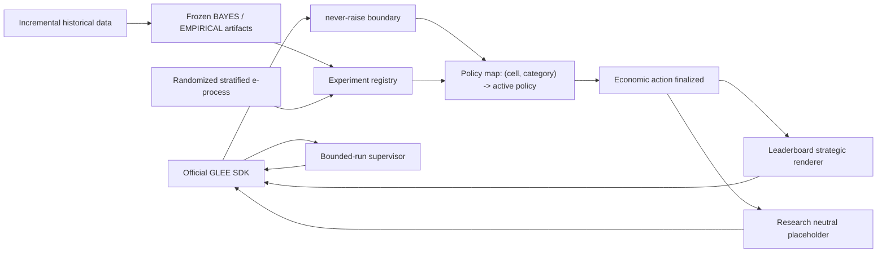

# Architecture

## Readiness classifications

Implementation status remains `IMPLEMENTED`, `VERIFIED`, `BLOCKED`, or
`NOT_YET_BUILT`. A separate operational classification applies to incomplete or
problematic work:

- `DEPLOYMENT_BLOCKER` means the gap can produce an invalid action, crash, timeout,
  hang, uncontrolled run, missing incumbent for a reachable cell, normal reliance on an
  unavailable input/artifact, a recurring catastrophic choice when a safer incumbent
  already exists, or policy latency that risks the turn limit.
- `RESEARCH_BLOCKED` means an advanced strategy or its validation is unavailable while
  the deployed incumbent remains intentional, legal, executable, and bounded in time.

The labels are orthogonal: for example, an unavailable BAYES artifact is
`BLOCKED + RESEARCH_BLOCKED` while its cell continues safely under ROBUST.

One transport process queues all selected game families through the official SDK. Each
arriving server-assigned game is classified by exact configuration and disclosed opponent
category (`human`, `agent`, or `hidden`). `leaderboard/policy_router.py` reads the policy
map and selects the currently supported policy for that tuple; there is no cross-cell
winner and the agent never chooses a cell.



## Configuration routing

Routing is an explicit derivation, not a dictionary lookup with a generic default. Every
decision logs `game_family`, exact `cell`, `role`, `theory_baseline`, BAYES eligibility,
loadable artifacts, promoted policy, selected policy, and fallback reason.

The family rules are:

- Complete-information bargaining selects its finite backward-induction or unlimited
  Rubinstein incumbent using the **current proposer** and, for finite games, the rounds
  remaining. A decision compares the offered share with the correct discounted
  continuation share. When both discount factors are one in an unlimited game, equal
  split is the explicit symmetric operational convention for the non-unique stationary
  split. The current API hides the opponent's discount factor in incomplete information
  and supplies no prior, so the Bayes-adaptive theory reference is not executable there.
  Those cells deliberately select `BARGAINING_INCOMPLETE_EQUAL_SPLIT`; this is a named
  conservative incumbent, not an emergency wrapper action. The missing prior is
  `RESEARCH_BLOCKED`, not a deployment blocker.
- Complete-information negotiation selects its T=1, finite-odd, finite-even, or
  unlimited-midpoint theory incumbent. Incomplete T=1 uses the trusted-prior posted-price
  baseline only when that prior is explicitly supplied; otherwise it uses its ROBUST
  baseline.
- Incomplete-information multi-round and unknown-horizon negotiation always uses the
  locked portfolio hierarchy: BAYES only when the eligibility gates pass and its frozen
  artifact loads; otherwise ROBUST. EMPIRICAL is considered only through an explicit
  promoted-policy registry entry. An absent eligibility record is logged as unavailable
  (`bayes_eligible=null`), while a recorded failed gate is logged as ineligible; both
  select ROBUST. Missing or corrupt BAYES artifacts also select ROBUST, never a generic
  reservation-value strategy.
- Every no-commitment persuasion cell keeps P0 babbling as theory incumbent unless a
  registered population challenger is promoted. Buyer P0 evaluates the actual visible
  `p`, `v`, `u`, and `product_price`, which reduces to the normalized build-spec threshold
  in the canonical price-one/low-value-zero case. The theorem retains weak indifference
  (`EV >= price`), while the production buyer requires the locked 2% safety margin
  (`EV >= 1.02 * price` for positive prices); zero price is handled separately. Seller
  P0 remains quality-independent in both text and binary modes and therefore executes
  even when buyer values are hidden.

The negotiation mechanism remains unbounded above. ROBUST bounds only its own action and
scenario sets: seller candidates are reservation-value multiples
`(1.00,1.10,1.25,1.50,2.00)` and buyer candidates are own-value fractions
`(0,.25,.50,.75,1)`. These are policy-generated decision sets, not legal mechanism
bounds. Seller-side buyer-value scenarios use `(1.00,1.25,1.50,2.00)` times the seller's
scale; the analogous buyer-side seller scenarios use `(0,.25,.50,.75,1)` times the
buyer's scale. Both choose minimum maximum regret, with agreement-favorable deterministic
ties (lower seller ask, higher buyer offer). No learned response model enters ROBUST.

When responding to an offer and a counteroffer remains legal, simplified v1 accepts only
if the offer is individually rational and at least as favorable as ROBUST's chosen
minimax-regret proposal; otherwise it counters with that proposal. On a terminal response
with no counteroffer, it accepts any individually rational offer and rejects a non-IR
offer. This proposal threshold is an explicit deterministic continuation reference, not
a probabilistic continuation-value estimate. A zero private value without a verified
positive configuration scale fails closed as `ROBUST_SCALE_UNAVAILABLE`. Unrecognized
families/configurations remain `UNSUPPORTED_CELL` and fail closed.

The current API exposes no buyer-value prior in incomplete-information T=1 negotiation.
The trusted-prior posted-price formula is therefore not executable live and is not routed
through learned multi-round BAYES eligibility. Both roles intentionally use the existing
unbounded-domain one-shot ROBUST incumbent. The full audit is in
`docs/configuration_coverage.md`.

## Action validation and turn budget

After state-envelope parsing, configuration routing, economic policy execution, and
communication rendering, `glee/actions.py` validates the exact action against the turn's
advertised field names and family invariants before submission. It rejects non-finite
numbers, invalid decisions, unadvertised keys, bargaining splits that do not sum to the
pot, and messages outside the internal 1,800-character limit. The outermost never-raise
boundary remains emergency protection around this whole path.

Current official competition documentation (retrieved 2026-08-21) confirms a 120-second
turn limit. Production budgets are p95 <= 10 seconds and maximum <= 30 seconds for local
policy work. Benchmarks include parsing, routing/policy computation, communication, and
validation but exclude network time; results are recorded in
`docs/latency_benchmark.md`.

## Layer boundaries

`theory/` contains only configuration-specific baselines. `policies/` contains fixed or
learned deviations. Population adaptation changes the named policy only through a
registered e-process promotion. Instance adaptation is native to that active policy:
BAYES updates one posterior, EMPIRICAL receives growing history with frozen weights,
ROBUST and pure theory do not update in v1. No generic second optimizer is applied.

Research IBO uses theory plus any policy-native instance conditioning. EG-SPM additionally
uses the evidence-backed population policy map. Both use the exact same neutral message
and never invoke strategic language. Economic experiments may use `communication.neutral`
only; communication experiments are the sole research location where language can be a
treatment. The leaderboard alone calls `communication.strategic.render`, and only after
the numeric/decision action is immutable.

## Architecture decision 2026-08-22: theory is an expert, not runtime scaffolding

The research decompositions remain useful and unchanged:

```text
IBO    = pi_theory + Delta_instance
EG-SPM = pi_theory + Delta_population + Delta_instance
```

Production no longer requires every executable policy to be represented as an additive
deviation from theory. Its conceptual pipeline is:

```text
structural-regime eligibility/routing
    -> selected policy expert
    -> expert-specific candidate generation
    -> expert-specific action selection
    -> communication rendering
```

Eligible experts may be THEORY, ROBUST, FAIRNESS/FAIRNESS_MARGIN, ADAPTIVE,
POOLED_EMPIRICAL, or a future promoted policy. THEORY remains the cold-start fallback,
safety baseline, evaluation control, and a source of candidates where useful. A validated
empirical expert may directly replace it for a supported structural regime. This does not
authorize moment-to-moment intuitive switching: policy-family routing remains frozen and
evidence-governed at the structural-regime level; only an already selected empirical
expert may choose dynamically within its declared candidate set.

## Promotion flow

Assignments are seeded, independent, 50/50, logged before outcomes, and stratified by
exact cell and observed opponent category. One append-only completed-game JSONL log feeds
the main and mirror e-processes. Within-cell Bonferroni uses fixed `M`; promotion requires
the main threshold plus `delta_min`, retention requires the mirror threshold, and an
expired unresolved window is inconclusive. A winner must then confirm on fresh data at
`M=1`. Only a completed registry entry changes the policy map.

Raw data, experiment logs, and unversioned artifacts are not required by leaderboard
runtime. Frozen model artifacts are versioned beneath `data/processed/models/negotiation`.

## Payoff transforms and research estimands

Bargaining and persuasion retain configuration/role-derived mechanism normalization.
Negotiation does not: its legal payoff is unbounded. Research instead records raw utility
`U` and applies the explicit v1 bounded statistical transform with
`S=max(|V_i|,1)`, `C=2S`, and `Y=(clip(U,-C,C)+C)/(2C)`. Every completed negotiation
experiment record contains raw payoff, `Y`, the clip bound, clipped utility, and a clipping
indicator; offline evaluation reports raw and transformed means together.

The negotiation promotion estimand is improvement in expected clipped scale-adjusted
utility, not unrestricted raw expected payoff. `delta_min=0.01` remains the promotion
margin. In the transform's unclipped linear region it corresponds locally to
`delta_U=4S*delta_Y=0.04S`, approximately 4% of the player's own valuation scale. This
equivalence is not asserted for clipped observations.

## Bounded-run lifecycle

Finite runs do not rely on `glee_sdk.GleeClient.run()`'s local completion counter.
`glee/supervisor.py` uses the SDK's lower-level queue, pending, move, game-state, stats,
and leave-queue methods. It tracks game IDs, counts each terminal ID once, and recognizes
own-move terminal results, opponent-initiated terminal game states, and disappearance
after tracking when the authoritative active count reaches zero. Once the requested
number of games has been tracked it leaves the family queue, preventing an extra match.

The outermost strategy boundary remains `never_raise`; every invocation of its legal
fallback emits a structured `strategy_fallback` event containing only game ID and error
type. Transient polling errors are logged and retried; identical pending states are not
submitted twice; and a hard overall safety deadline prevents indefinite idling. Cleanup
calls `leave_queue()` on every exit path and logs the exact exit reason. With
`requeue=False`, the supervisor makes one queue call only.

Finite MVL pilots use bounded `requeue=True` only to top up one sequential slot until the
declared maximum has been tracked. The supervisor leaves the family queue as soon as that
count is reached, so top-up cannot create game N+1. A stop callback closes queueing in the
same iteration as a hard operational event and drains already-tracked play before
returning with `STOP_REQUESTED`. Strategic-review events are recorded for post-pilot
human review and do not change a frozen policy or stop the declared family count.
`glee/pilot.py` records the frozen commit, every state/action/route,
latency, terminal result/payoff, rating snapshots when available, and exact exit reason;
it never reads or serializes the API credential. Predeclared conditions are in
`docs/pilot_stop_conditions.md`.

All unknown-horizon bargaining and negotiation incumbents additionally have an intentional
no-progress terminal rule. On the third consecutive identical rejected offer/response
pair, ROBUST negotiation, complete-information midpoint negotiation, or the bargaining incumbent chooses the advertised walk-away
action as part of the named policy. A materially changed offer resets the count; finite
games and persuasion are excluded. The pilot controller independently mirrors this
condition as an emergency backstop. If the backstop ever fires because a production
policy failed to exit normally, it remains a hard operational stop rather than being
misreported as ordinary incumbent behavior.

## Human-authorized behavioral pilot layer

`leaderboard/experimental_overrides.py` is an explicit, process-scoped registry. Default
construction is disabled. Only `scripts/run_pilot.py --human-authorized-experimental`
enables its fixed configuration/policy scopes, with
`authorization_source=human_authorized_bounded_pilot`. Exiting that process disables the
overrides; no persistent leaderboard configuration is changed.

Routes distinguish `THEORY_INCUMBENT`, `PORTFOLIO_INCUMBENT`,
`E_PROCESS_PROMOTED`, and `HUMAN_AUTHORIZED_EXPERIMENTAL`. Every route logs the normal
baseline policy, candidate experimental policy, authorization source/status, selected
policy, and policy-specific diagnostics. A human-authorized challenger never acquires or
masquerades as e-process promotion, and an existing e-process promotion is not displaced
by this registry.

The bounded registry selects the fixed 15% negotiation fairness margin only for complete
finite full-extraction controls, `NEGOTIATION_ADAPTIVE` only where static ROBUST is the
normal incomplete-information control, and bargaining fairness for bargaining controls.
It records seller-side P3 as unavailable unless a real frozen population trust rate is
provided. Buyer persuasion remains P0.

For persuasion seller turns, the policy-supplied message/recommendation is the economic
action and the communication renderer preserves it (subject only to the length ceiling).
For numeric negotiation/bargaining actions and bare decisions, the renderer may still add
deterministic text after the economic fields are fixed.

`NEGOTIATION_ADAPTIVE` imports ROBUST's first/reference price without modifying ROBUST.
It uses only current-game public offers and a locked reciprocal concession rate of 0.35.
It anchors on the first opponent offer and measures cumulative improvement from that
anchor: rising buyer offers improve from a seller's perspective and falling seller offers
improve from a buyer's perspective. It moves 35% of that observed concession toward
agreement, subject to the acting player's own IR boundary. Worsening or repeated offers
do not create additional concessions.
Its nonterminal acceptance approximation accepts an IR offer at 90% of the payoff from
its current adaptive counter; terminal decisions accept every IR offer. Its unknown-
horizon guard requires both a materially unchanged adaptive counter and no material
opponent improvement. This is deterministic observed-history conditioning—not a
posterior, calibrated response model, or equilibrium.

## Pooled population challengers

`NEGOTIATION_POOLED_EMPIRICAL` is distinct from exact-cell BAYES. It pools public
historical proposal responses across scale-equivalent games while keeping role,
information regime, horizon observability, round position, messages, and opponent
category explicit. Seller and buyer proposal-response models are separate regularized
logistic models with validation-only calibration and game-level deterministic
train/validation/test splits. Features are pre-outcome and own-scale normalized; hidden
opponent values, outcomes, post-decision information, and opponent identity are not
features.

The empirical policy scores a finite, auditable set of named policy candidates rather
than treating that set as a legal price bound. It enforces own IR, excludes proposal
margins outside the model's fitted support, and logs every candidate's predicted response
probability, one-step value, exclusion reason, chosen action, and artifact version.
Unknown/hidden opponent categories are outside the frozen artifact's support and retain
the ROBUST incumbent. A missing or corrupt artifact also leaves the incumbent active.

The process-scoped experimental registry can make a stable 50/50 assignment between an
eligible pooled challenger and its incumbent before an outcome is observed. This code is
implemented and tested. The first one-step selector failed for aggressive endpoint
choices. A subsequent continuation-aware risk grid kept the response model frozen and
represented ACCEPT, one additional opportunity, and terminal nonagreement explicitly,
but no tested parameter combination achieved complete feasible coverage or corrected the
seller endpoint pathology. A genuinely response-independent public holdout was also
unavailable because every public game was already assigned to model train/calibration/
test and the authoritative source had no newer data. The pooled policy is therefore
`PAUSED_FOR_COMPETITION_CYCLE`; even the earlier human-authorized validation constructor
fails closed to ROBUST with a structured pause reason.

`PERSUASION_POOLED_EMPIRICAL` is a separate seller-side offline response-model challenger.
It neither replaces the production buyer's 2% margin nor supplies the missing P3 trust
artifact. Its alternative-message estimates are explicitly counterfactual and are not
live-authorized.

Policy findings use the canonical categories in `research/status.py`:
`MECHANICAL_POLICY_BUG`, `CONTROL_POLICY_LIMITATION`, `MISSING_POPULATION_LAYER`, and
`RESEARCH_BLOCKED`. In particular, the old ADAPTIVE anchor was a mechanical bug, static
ROBUST's nonadaptation is an auditable control limitation, exact-cell starvation was a
missing population layer, and the absent P3 trust artifact remains research-blocked.

Complete-information one-shot negotiation keeps exact theory at seller price `p=V_B`
under accept-at-indifference. The separately authorized production behavioral path uses
`NEGOTIATION_FAIRNESS_MARGIN` with locked `SURPLUS_CONCESSION=0.15`; it is a deliberate
deviation, not a rewrite of the theory baseline.

Pilot/tranche monitoring retains exact cell/role groups and adds structural policy
classes that omit nuisance monetary scales. Structural results record
agreement/completion, no-deal and walk-away rates; mean/median raw and scale-adjusted
payoffs; rating changes; opponent categories; fallbacks; invalid actions; and policy
latency. Bargaining stores `own_payoff / money_to_divide`; negotiation stores raw payoff
and its bounded statistical `Y` transform; persuasion does not gain a fabricated new
transform.

## Time-constrained tranche authorization

`ExperimentalOverrideRegistry.human_authorized_tranche()` is a separate, process-scoped
map rather than a reuse of the broader behavioral-pilot profile. It activates bargaining
FAIRNESS wherever defined and negotiation FAIRNESS_MARGIN only on complete finite
extraction controls. It never attempts persuasion P3, never routes II/T=1 through the
multi-round gate, and assigns ADAPTIVE only to the first six distinct eligible incomplete
multi-round/unknown-horizon games. That assignment is explicitly diagnostic and
nonrandom: the tested experiment primitive exists, but there is no live cell-matched
randomized router binding pre-outcome assignments to the bounded supervisor. Repeated
states in one game retain one frozen assignment.

The tranche supervisor still uses controlled bounded top-ups at concurrency one. The
tranche commit and tracked files must remain unchanged. Immediate operational events stop
the family. Predeclared strategic rules pause a scale-invariant policy class after the
specified sample thresholds. A paused experimental class reverts future matches to the
unchanged incumbent; an active game never changes policy. If the paused class is an
incumbent with no defined alternative, the family run drains and stops rather than
inventing a replacement. Every pause, reason, and whether incumbent reversion is possible
is structured in the JSONL log. The exact map and thresholds are frozen in
`docs/leaderboard_tranche_plan.md`.
