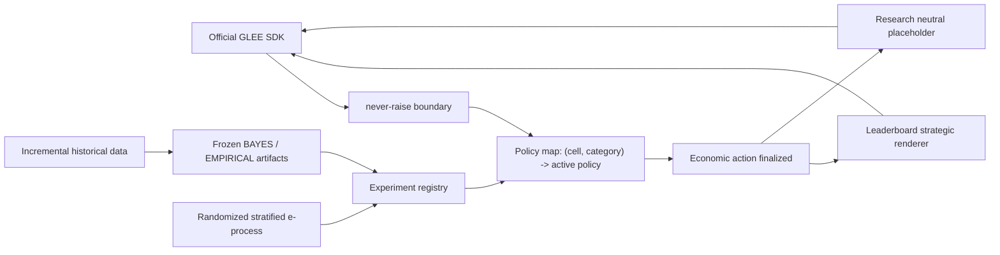

# Architecture

One transport process queues all selected game families through the official SDK. Each
arriving server-assigned game is classified by exact configuration and disclosed opponent
category (`human`, `agent`, or `hidden`). `leaderboard/policy_router.py` reads the policy
map and selects the currently supported policy for that tuple; there is no cross-cell
winner and the agent never chooses a cell.

## Layer boundaries

`theory/` contains only configuration-specific baselines. `policies/` contains fixed or
learned deviations. Population adaptation changes the named policy only through a
registered e-process promotion. Instance adaptation is native to that active policy:
BAYES updates one posterior, EMPIRICAL receives growing history with frozen weights,
ROBUST and pure theory do not update in v1. No generic second optimizer is applied.

Research IBO uses theory plus any policy-native instance conditioning. EG-SPM additionally
uses the evidence-backed population policy map. Both use the exact same neutral message
and never invoke strategic language. Economic experiments may use `communication.neutral`
only; communication experiments are the sole research location where language can be a
treatment. The leaderboard alone calls `communication.strategic.render`, and only after
the numeric/decision action is immutable.

## Promotion flow

Assignments are seeded, independent, 50/50, logged before outcomes, and stratified by
exact cell and observed opponent category. One append-only completed-game JSONL log feeds
the main and mirror e-processes. Within-cell Bonferroni uses fixed `M`; promotion requires
the main threshold plus `delta_min`, retention requires the mirror threshold, and an
expired unresolved window is inconclusive. A winner must then confirm on fresh data at
`M=1`. Only a completed registry entry changes the policy map.

Raw data, experiment logs, and unversioned artifacts are not required by leaderboard
runtime. Frozen model artifacts are versioned beneath `data/processed/models/negotiation`.
