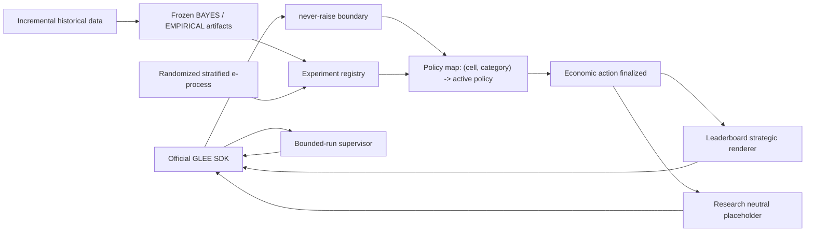

# Architecture

One transport process queues all selected game families through the official SDK. Each
arriving server-assigned game is classified by exact configuration and disclosed opponent
category (`human`, `agent`, or `hidden`). `leaderboard/policy_router.py` reads the policy
map and selects the currently supported policy for that tuple; there is no cross-cell
winner and the agent never chooses a cell.

## Configuration routing

Routing is an explicit derivation, not a dictionary lookup with a generic default. Every
decision logs `game_family`, exact `cell`, `role`, `theory_baseline`, BAYES eligibility,
loadable artifacts, promoted policy, selected policy, and fallback reason.

The family rules are:

- Bargaining selects one of the four configuration-specific theory incumbents
  (complete/incomplete crossed with finite/unlimited). An unavailable challenger does not
  change that incumbent. If required theory inputs such as the incomplete-information
  prior are absent, execution fails closed to the advertised legal fallback while the
  selected incumbent remains visible in the route record.
- Complete-information negotiation selects its T=1, finite-odd, finite-even, or
  unlimited-midpoint theory incumbent. Incomplete T=1 uses the trusted-prior posted-price
  baseline only when that prior is explicitly supplied; otherwise it uses its ROBUST
  baseline.
- Incomplete-information multi-round and unknown-horizon negotiation always uses the
  locked portfolio hierarchy: BAYES only when the eligibility gates pass and its frozen
  artifact loads; otherwise ROBUST. EMPIRICAL is considered only through an explicit
  promoted-policy registry entry. An absent eligibility record is logged as unavailable
  (`bayes_eligible=null`), while a recorded failed gate is logged as ineligible; both
  select ROBUST. Missing or corrupt BAYES artifacts also select ROBUST, never a generic
  reservation-value strategy.
- Every no-commitment persuasion cell keeps P0 babbling as theory incumbent unless a
  registered population challenger is promoted.

The negotiation mechanism remains unbounded above. ROBUST bounds only its own action and
scenario sets: seller candidates are reservation-value multiples
`(1.00,1.10,1.25,1.50,2.00)` and buyer candidates are own-value fractions
`(0,.25,.50,.75,1)`. These are policy-generated decision sets, not legal mechanism
bounds. Seller-side buyer-value scenarios use `(1.00,1.25,1.50,2.00)` times the seller's
scale; the analogous buyer-side seller scenarios use `(0,.25,.50,.75,1)` times the
buyer's scale. Both choose minimum maximum regret, with agreement-favorable deterministic
ties (lower seller ask, higher buyer offer). No learned response model enters ROBUST.

When responding to an offer and a counteroffer remains legal, simplified v1 accepts only
if the offer is individually rational and at least as favorable as ROBUST's chosen
minimax-regret proposal; otherwise it counters with that proposal. On a terminal response
with no counteroffer, it accepts any individually rational offer and rejects a non-IR
offer. This proposal threshold is an explicit deterministic continuation reference, not
a probabilistic continuation-value estimate. A zero private value without a verified
positive configuration scale fails closed as `ROBUST_SCALE_UNAVAILABLE`. Unrecognized
families/configurations remain `UNSUPPORTED_CELL` and fail closed.

## Layer boundaries

`theory/` contains only configuration-specific baselines. `policies/` contains fixed or
learned deviations. Population adaptation changes the named policy only through a
registered e-process promotion. Instance adaptation is native to that active policy:
BAYES updates one posterior, EMPIRICAL receives growing history with frozen weights,
ROBUST and pure theory do not update in v1. No generic second optimizer is applied.

Research IBO uses theory plus any policy-native instance conditioning. EG-SPM additionally
uses the evidence-backed population policy map. Both use the exact same neutral message
and never invoke strategic language. Economic experiments may use `communication.neutral`
only; communication experiments are the sole research location where language can be a
treatment. The leaderboard alone calls `communication.strategic.render`, and only after
the numeric/decision action is immutable.

## Promotion flow

Assignments are seeded, independent, 50/50, logged before outcomes, and stratified by
exact cell and observed opponent category. One append-only completed-game JSONL log feeds
the main and mirror e-processes. Within-cell Bonferroni uses fixed `M`; promotion requires
the main threshold plus `delta_min`, retention requires the mirror threshold, and an
expired unresolved window is inconclusive. A winner must then confirm on fresh data at
`M=1`. Only a completed registry entry changes the policy map.

Raw data, experiment logs, and unversioned artifacts are not required by leaderboard
runtime. Frozen model artifacts are versioned beneath `data/processed/models/negotiation`.

## Payoff transforms and research estimands

Bargaining and persuasion retain configuration/role-derived mechanism normalization.
Negotiation does not: its legal payoff is unbounded. Research instead records raw utility
`U` and applies the explicit v1 bounded statistical transform with
`S=max(|V_i|,1)`, `C=2S`, and `Y=(clip(U,-C,C)+C)/(2C)`. Every completed negotiation
experiment record contains raw payoff, `Y`, the clip bound, clipped utility, and a clipping
indicator; offline evaluation reports raw and transformed means together.

The negotiation promotion estimand is improvement in expected clipped scale-adjusted
utility, not unrestricted raw expected payoff. `delta_min=0.01` remains the promotion
margin. In the transform's unclipped linear region it corresponds locally to
`delta_U=4S*delta_Y=0.04S`, approximately 4% of the player's own valuation scale. This
equivalence is not asserted for clipped observations.

## Bounded-run lifecycle

Finite runs do not rely on `glee_sdk.GleeClient.run()`'s local completion counter.
`glee/supervisor.py` uses the SDK's lower-level queue, pending, move, game-state, stats,
and leave-queue methods. It tracks game IDs, counts each terminal ID once, and recognizes
own-move terminal results, opponent-initiated terminal game states, and disappearance
after tracking when the authoritative active count reaches zero. Once the requested
number of games has been tracked it leaves the family queue, preventing an extra match.

The outermost strategy boundary remains `never_raise`; every invocation of its legal
fallback emits a structured `strategy_fallback` event containing only game ID and error
type. Transient polling errors are logged and retried; identical pending states are not
submitted twice; and a hard overall safety deadline prevents indefinite idling. Cleanup
calls `leave_queue()` on every exit path and logs the exact exit reason. With
`requeue=False`, the supervisor makes one queue call only.
